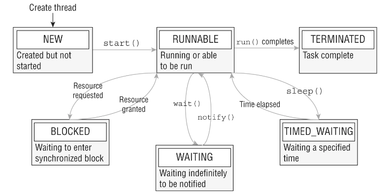

# Concepts

A _thread_ is the smallest unit of execution that can be scheduled by the operating system.

A _process_ is a group of associated threads that execute in the same shared environment.

This _shared environment_ allows that the threads in the same process share the same memory space and can communicate with one another. For example, there can be in the _shared memory_ static variables as well as instance and local variables passed to a thread.

A _task_ is a single unit of work performed by a thread. A thread can complete multiple independent tasks but only one task at a time.

_Concurrency_ is the property of executing multiple threads and processes at the same time. A _thread scheduler_ is used by operating systems to determine which threads should be currently executing. For example, it can use a round-robin schedule.

A _context switch_ is the process of storing a thread's current state and later restoring the state of the thread to continue execution.

A _thread priority_ is a numeric value associated with a thread that is taken into consideration by the thread scheduler when determining which threads should currently be executing. In Java, thread priorities are specified as integer values.

A _system thread_ is created by the JVM and runs in the background of the application. For example, garbage collection.

A _user-defined thread_ is one created by the application developer to accomplish a specific task.

System and user-defined threads can both be created as daemon threads. A _daemon thread_ is one that will not prevent the JVM from exiting when the program finishes. A Java application terminates when the only threads that are running are daemon threads. By default, user-defined threads are not daemons, and the program will wait for them to finish.

A _thread pool_ is a group of pre-instantiated reusable threads that are available to perform a set of arbitrary tasks.

_Thread-safety_ is the property of an object that guarantees safe execution by multiple threads at the same time.

_Race condition_ is the unexpected result of two tasks executing at the same time.

_Atomic_ is the property of an operation to be carried out as a single unit of execution without any interference from another thread.

# Thread states

